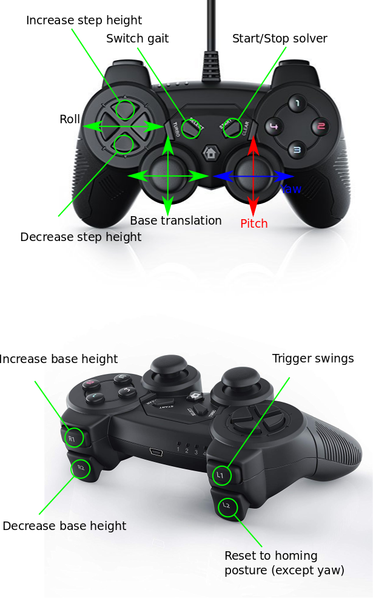

## Whole body controller with inverse dynamics

TODO

## Requirements

The code has been tested on Ubuntu 16.04 with ROS Kinetic.
In order to compile the code you need ros-control and ros-controllers.
Moreover, you need to install the advr-superbuild (for OpenSoT).
To ease the process, I created a simple script which install all the required packages:

`./install_dependencies.sh`

## Compilation

First create a ros workspace

`mkdir -p $HOME/wb_ws/src && catkin_init_workspace $HOME/wb_ws/src`

and clone the repository in it

`cd $HOME/wb_ws/src && git clone https://github.com/graiola/wbc`

If you did not install the required dependencies, now it is the time to do so. Run the following script:

`./install_dependencies.sh`

now you can compile the catkin workspace:

`cd $HOME/wb_ws/ && catkin_make -DCMAKE_BUILD_TYPE=Release`

and don't forget to bash the devel!

`source $HOME/wb_ws/devel/setup.bash`

## Launch

To launch the controller:

`roslaunch wb_controller wb_controller_bringup.launch`

## Joypad commands

## Legal notes

This work is licensed under a [license](http://creativecommons.org/licenses/by-nc-sa/4.0/) Creative Commons Attribution-NonCommercial-ShareAlike 4.0 International License</a>.

